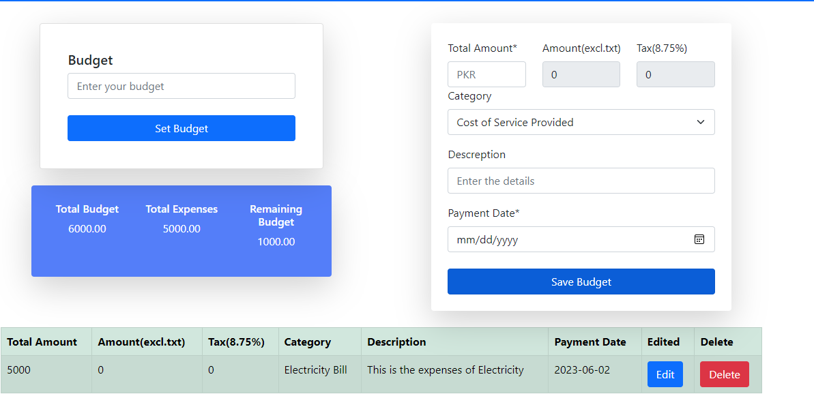
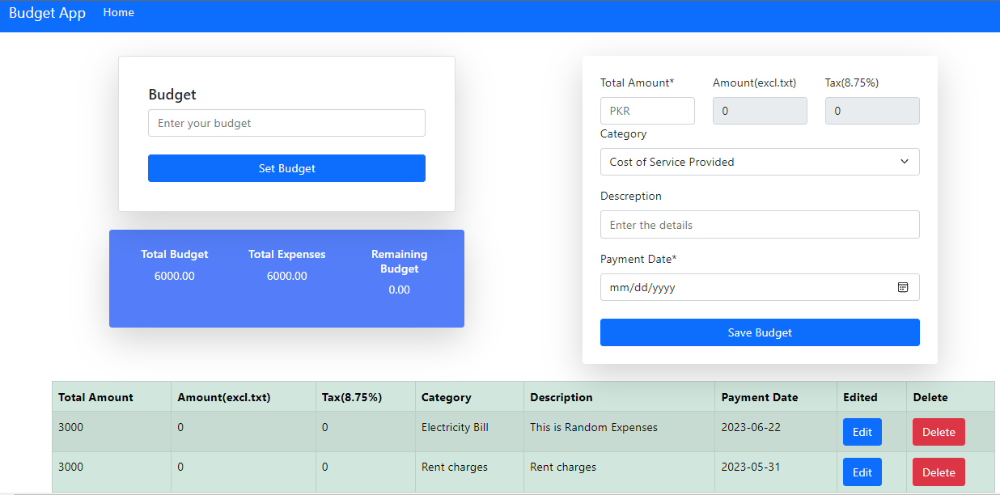
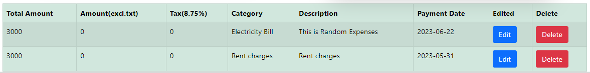

# Budget-App-Saylani-Project



## Description

Budget Tracker is a web application that allows you to track your expenses and manage your budget effectively. It provides a simple and intuitive interface to add and view expenses, calculate total expenses, and keep track of the remaining budget.

## Features

- Set your total budget and track your expenses.
- Add expenses with details such as amount, category, description, and payment date.
- View a summary of total expenses and remaining budget.
- Edit or delete existing expenses.
- Responsive design for seamless usage across devices.

## Screenshots





## Installation

1. Clone the repository:
2. Navigate to the project directory:
3. Open the index.html file in your preferred web browser.

To use the Budget App locally, follow these steps:

1. Clone the repository to your local machine:

   ```bash
   git clone https://github.com/your-username/budget-app.git
   cd budget-app
   
Open the `index.html` file in your web browser.

## Contributing

Contributions are welcome! If you find any issues or have suggestions for improvements, please feel free to open an issue or submit a pull request.

To contribute to the Budget App, follow these steps:

1. Fork the repository.
2. Create a new branch for your feature or bug fix:
    ```bash
    git checkout -b feature/your-feature-name

3. Make your changes and commit them:
    ```bash
    git commit -m "Your commit message"
    
4. Push your changes to your forked repository:
    ```bash
    git push origin feature/your-feature-name

5. Open a pull request from your forked repository to the main repository.


## License

This project is licensed under the [MIT License](LICENSE).

## Acknowledgements

- This project was inspired by the need for a simple budget tracking solution.
- The project utilizes HTML, CSS, and JavaScript.

## Contact
Make sure to replace `"https://github.com/qudosabdu/BudgetTrackerApp.git"` with the actual URL of your repository in the installation instructions.
For any inquiries or feedback, please contact [abdulqudoospk737@gmail.com](mailto:your-email@example.com).

